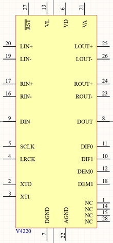
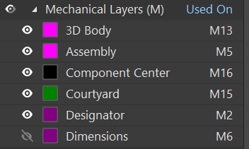
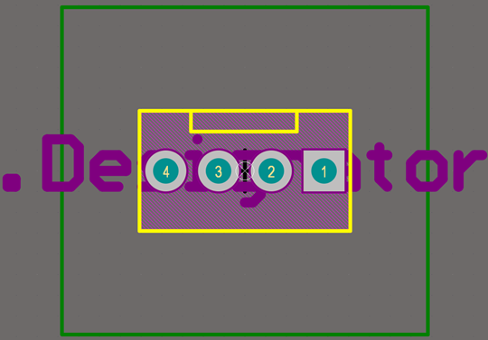
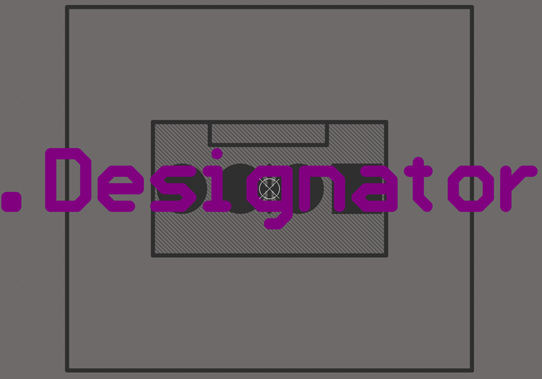
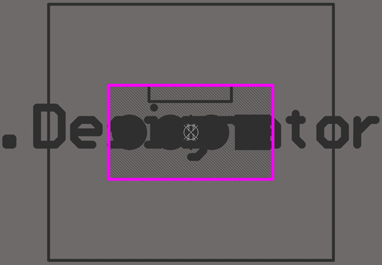
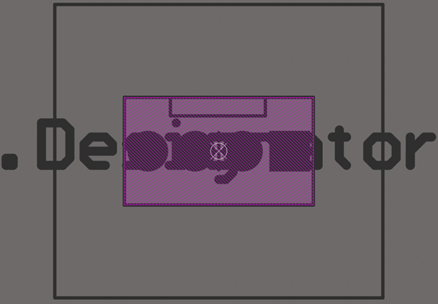
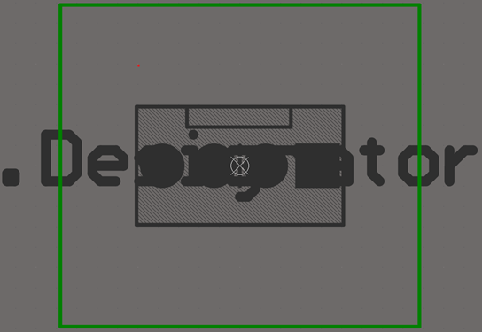
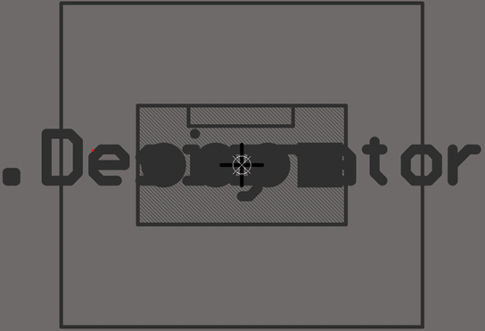

# AltiumLib

## Intro

This a local library for Altium Designer of all components used during EC projects. To reuse components from this library, I copy paste them in a new library for the specific project.

## Schematic

### Pins

- Pin designator relates to the footprint pad.
- Pin name relates to the pin function in the component's datasheet.
- Pin length should be 200mil. 
- Pins should be separated by 200mil minimum, except when they'll be explicitly connected to the same net.
In that case 100mil is acceptable.
- All pins of the package should be instantiated, exception can be made for components that aren't presented in box format, like transistors.
- Electrical type is passive for all pins.

### Graphics

- Component should be as centered as possible on the sheet.
- Boxes should be all the same yellow color and red borders.
- Pins can go on all 4 sides of a box component.
- Usually up is for VCC and reset, down is for ground, left is for input and right is for output.

Here's an exemple:

### Parameters

Required parameters for all components are:

- **Value**: Set to visible. Same as Component ID. This is the main reference of the component. You would use it's manufacturer's part number. Try and be specific, add all the letters at the end of an IC's name to precise the package. 
- **Manufacturer**: Manufacturer of the component. The component can be generic.
- **Category**: Listed in the table below.
- **Sub-Category**: Listed in the table below.

Optional parameters are:

- **Notes**: Set to visible. Important specs about the component you would want to see on the schematic. For a capacitor for example, you can put the capacitance value, voltage rating, etc.
- **Package**: Set to visible if necessary. Useful to be visible for SMD resistors and MLCC capacitors. You can add a package for ICs in standard packages.
- Any other parameter: Not visible and not in favorites.

Here's some exemples of parameters:

### Categories

| **Category** | **Sub-Category** | **Designator** |
|--------------|------------------|----------------|
| Resistor     | SMD              | R?             |
|              | Pot              | VR?            |
|              | THT              | R?             |
|              | Fuse             | F?             |
|              |                  |                |
| Capacitor    | MLCC             | C?             |
|              | Film             | C?             |
|              | Electrolytic     | C?             |
|              |                  |                |
| Inductor     | Power            | L?             |
|              | Ferrite          | L?             |
|              | Filter           | L?             |
|              | Transformer      | L?             |
|              |                  |                |
| IC           | OpAmp            | U?             |
|              | Audio            | U?             |
|              | Power            | U?             |
|              | CPU              | U?             |
|              | Oscillator       | U?             |
|              | Memory           | U?             |
|              | Logic            | U?             |
|              | Comparator       | U?             |
|              | Sensor           | U?             |
|              | Optical          | U?             |
|              |                  |                |
| Switch       | Mechanical       | SW?            |
|              | Relay            | RL?            |
|              | Encoder          | EN?            |
|              |                  |                |
| Connector    | XLR              | J?             |
|              | USB              | J?             |
|              | Jack             | J?             |
|              | FPC              | J?             |
|              | Header           | J?             |
|              | RJ45             | J?             |
|              | Bloc             | J?             |
|              | Coax             | J?             |
|              |                  |                |
| Transistor   | MOSFET           | Q?             |
|              | BJT              | Q?             |
|              |                  |                |
| Diode        | TVS              | D?             |
|              | LED              | D?             |
|              | Signal           | D?             |
|              | Power            | D?             |
|              |                  |                |
| Module       | Display          | DISP?          |
|              | CPU              | U?             |
|              | Amp              | U?             |
|              |                  |                |
| Mechanical   | Screw            | M?             |
|              | Test Point       | M?             |
|              | Spacer           | M?             |

## Footprints

- Vias hole should be at least 0.3mm
- Pad 1 should be square if possible

The footprints use different single mechanical layers to convey information about the component.
Here's a list of the layers used:

### Layer 2: Designator

This layer is used to display the component's designator for assembly drawing.  
Simply put a text containing ".Designator" on this layer. The text is in default font, centered on the component, stroke width should be 20% of the text height.
The text size should roughly match the component's assembly size.

### Layer 5: Assembly

This layer is used to display the component's physical size. Any space that the component occupies should be drawn.  
This is the shape that will be drawn on the assembly drawing along with the designator.

### Layer 6: Dimensions (optional)

This layer is used to display important dimension of the PCB project. **Most components don't need to used this layer.**  
However, mechanical components, like screws cans use this layer to display the dimensions of the screw holes or other important dimensions.

### Layer 13: 3D Body

This layer is used to add the step file containing the 3D body of the component. Almost all components should have a 3D representation.  
Most step files can be found on the manufacturer's website or on [3dcontentcentral](https://www.3dcontentcentral.com).

### Layer 15: Courtyard

Courtyard is a box to indicate a perimeter of caution around the component and it's overlay.  
For through hole components it's a perimeter of 5mm. For SMD components it's a perimeter of 0.25mm.

### Layer 16: Component center

This layer is used to indicate the center of the component with two 2mm lines forming a cross.

