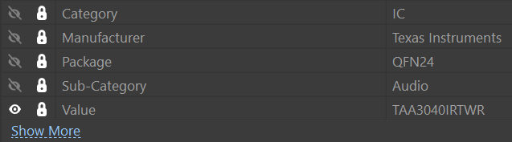
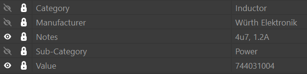

# AltiumLib

## Intro

This a local library for Altium Designer of all components used during EC projects. To reuse components from this library, I copy paste them in a new library for the specific project.

## Schematic

### Parameters

### Categories

| **Category** | **Sub-Category** | **Designator** |
|--------------|------------------|----------------|
| Resistor     | SMD              | R?             |
|              | Pot              | VR?            |
|              |                  |                |
| Capacitor    | MLCC             | C?             |
|              | Film             | C?             |
|              | Electrolytic     | C?             |
|              |                  |                |
| Inductor     | Power            | L?             |
|              | Ferrite          | L?             |
|              | Filter           | L?             |
|              | Transformer      | L?             |
|              |                  |                |
| IC           | OpAmp            | U?             |
|              | Audio            | U?             |
|              | Power            | U?             |
|              | CPU              | U?             |
|              | Oscillator       | U?             |
|              | Memory           | U?             |
|              | Logic            | U?             |
|              | Comparator       | U?             |
|              | Sensor           | U?             |
|              |                  |                |
| Switch       | Mechanical       | SW?            |
|              | Relay            | RL?            |
|              | Encoder          | EN?            |
|              |                  |                |
| Connector    | XLR              | J?             |
|              | USB              | J?             |
|              | Jack             | J?             |
|              | FPC              | J?             |
|              | Header           | J?             |
|              |                  |                |
| Transistor   | MOSFET           | Q?             |
|              | BJT              | Q?             |
|              |                  |                |
| Diode        | TVS              | D?             |
|              | LED              | D?             |
|              | Signal           | D?             |
|              | Power            | D?             |
|              |                  |                |
| Module       | Display          | DISP?          |

## Footprints

### Layers
